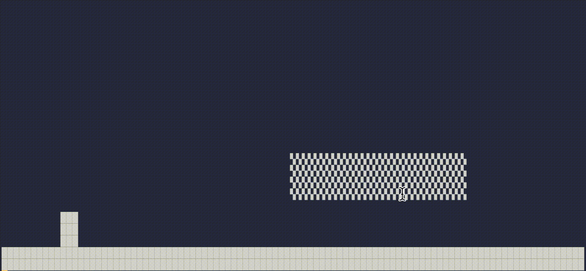

# PhySim

A basic physics platformer simulation.



## Setup

Clone the project.
```zsh
git clone https://github.com/gustavwilliam/physim
```

Navigate to inside the project directory.
```zsh
cd physim
```

### Install dependencies

The project uses Poetry for dependency managment.
```zsh
poetry install
```

## Usage

Start running PhySim using the following command.
```zsh
poetry run python physim
```

### Exiting
Press one of the following key (combinations) to quit:
- `q`
- `<CTRL>` + `c`

## Contols

To control the player figure, use the any of the following keys:
- Jump: `<SPACE>`
- Left: `a` or `←`
- Right: `d` or `→`

Have fun!